  <h1>🕶️ 3DIAL – 3D Avatar for Virtual Presence</h1>
  

    <strong>3DIAL</strong> is an AI-powered web application for creating realistic, interactive 3D avatars with cloned human voices, natural lip-sync, and intelligent AI assistance. It enables anyone to have a personal, expressive digital presence for presentations, communication, and accessibility.
  

  

  <h2>System Overview</h2>
  

    3DIAL uses Ready Player Me API for avatars, Real-Time Voice Cloning for personalized voices, Wav2Lip for natural lip-sync, and Gemini AI for guidance. Secure multi-factor authentication makes it private and safe.
  

  <h3>Architecture & Workflow</h3>
  <ul>
    <li>User registers/login (OTP+email verification)</li>
    <li>Upload a face image &rarr; 3D avatar generated</li>
    <li>Upload/record voice sample &rarr; Voice clone produced</li>
    <li>Sync voice & avatar &rarr; Output video</li>
    <li>AI-powered interaction and download options</li>
  </ul>

  <h2>Features</h2>
  <ul>
    <li><strong>3D Avatars:</strong> Quick generation from images (.glb format)</li>
    <li><strong>Voice Cloning:</strong> Personalized speech output (.wav)</li>
    <li><strong>Lip Sync Videos:</strong> Avatar lips sync to audio (.mp4)</li>
    <li><strong>AI Assistance:</strong> Context-aware interaction (Gemini AI)</li>
    <li><strong>Accessibility:</strong> Designed for users with speech or mobility challenges</li>
    <li><strong>Secure:</strong> OTP & email-based verification</li>
    <li><strong>Easy Download:</strong> Export all outputs</li>
  </ul>

<h2>Demo Screenshots</h2>

  <strong>Landing Page:</strong> 
    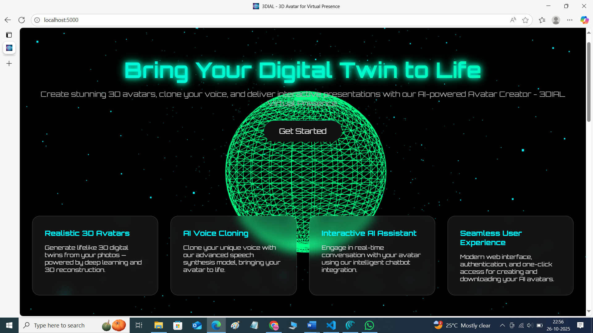
    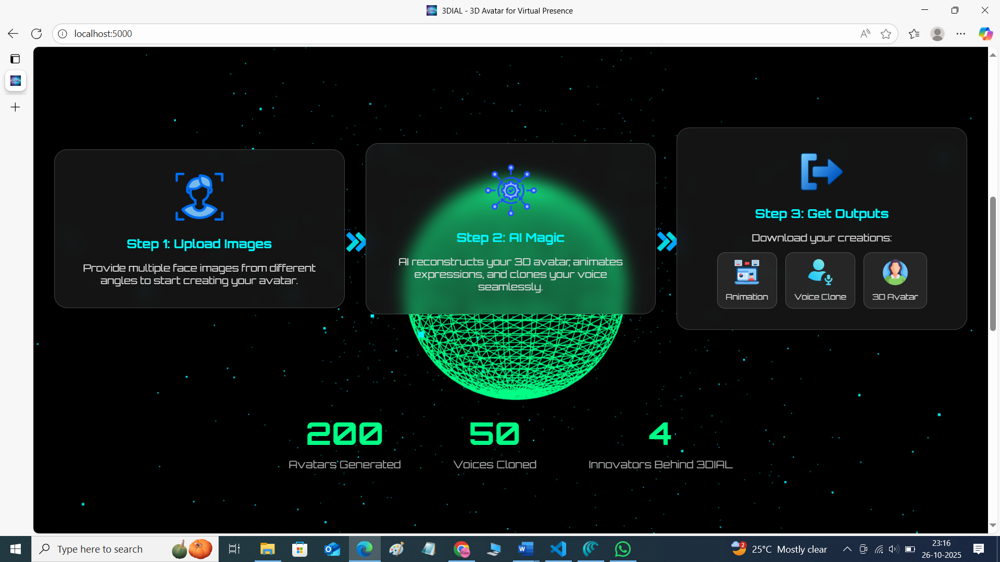
    
  <strong>Authentication:</strong> 
    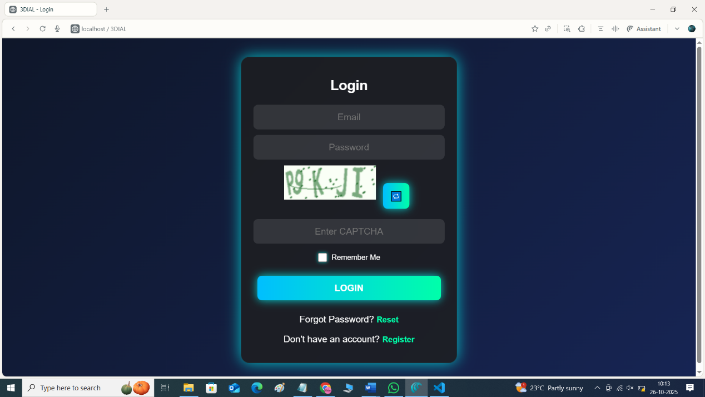
    
  <strong>Dashboard:</strong> 
    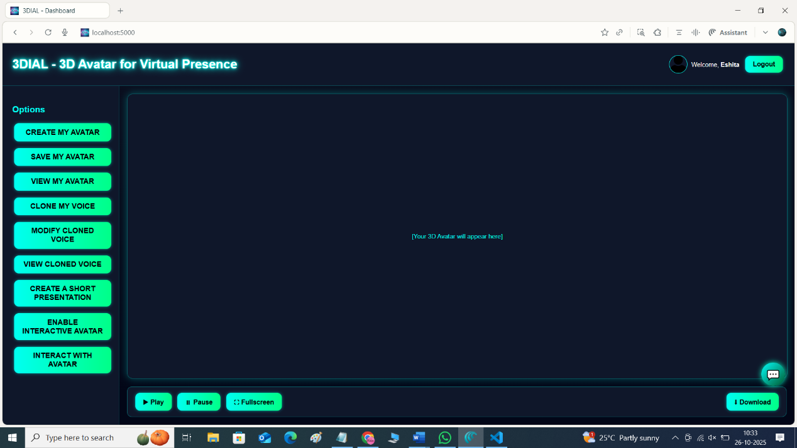
    
  <strong>Chatbot:</strong> 
    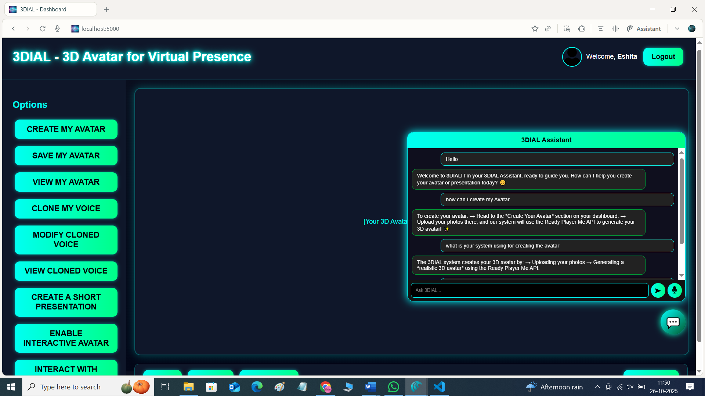
    
  <strong>Create Avatar:</strong> 
    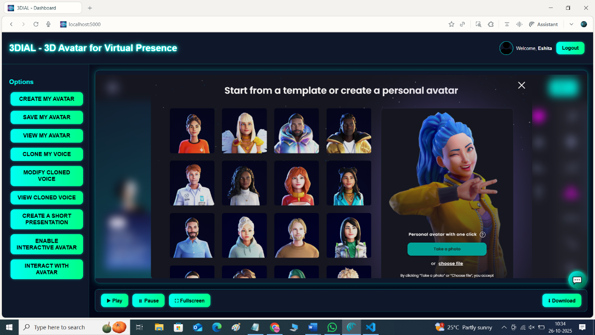
    
  <strong>Voice Cloning:</strong> 
    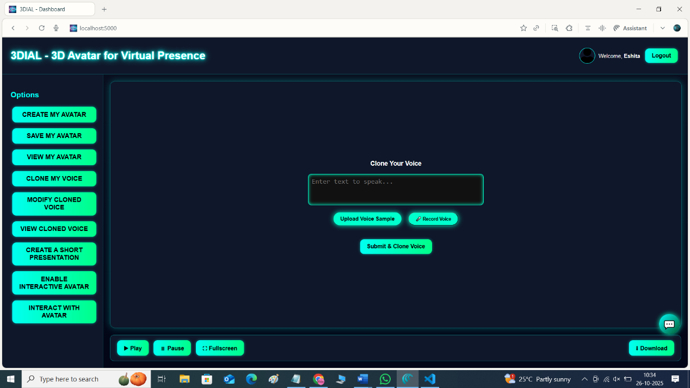
    
  <strong>Download Options:</strong> 
    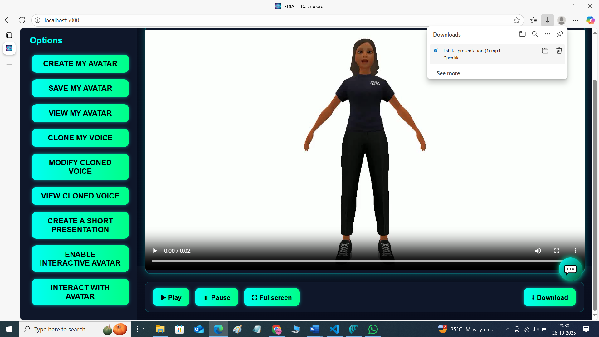
    
  <strong>Interactive Avatar:</strong> 
    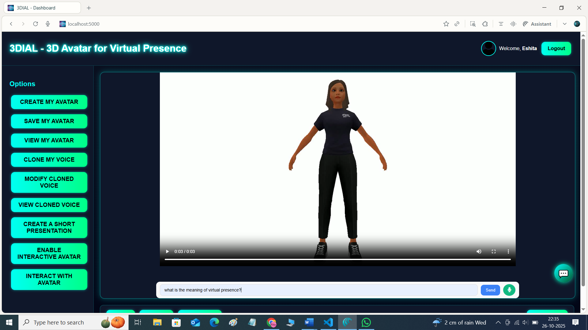
    
  <strong>Lip Sync:</strong> 
    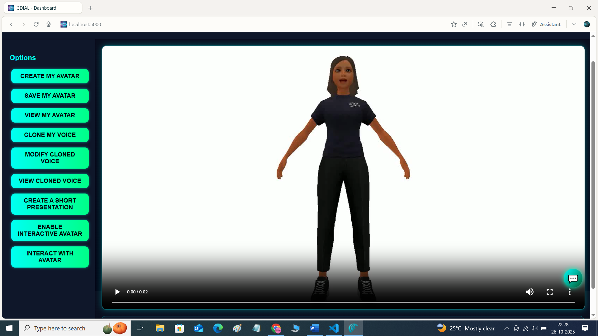
    
  <strong>System Architecture:</strong> 
    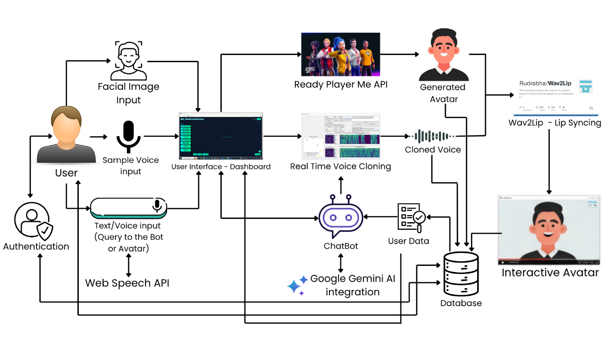

  <h2>Technologies Used</h2>
  <ul>
    <li><strong>Frontend:</strong> HTML, CSS, JS, Jinja2</li>
    <li><strong>Backend:</strong> Python (Flask)</li>
    <li><strong>3D Avatars:</strong> Ready Player Me API</li>
    <li><strong>Voice:</strong> Real-Time Voice Cloning, Librosa</li>
    <li><strong>Lip Sync:</strong> Wav2Lip</li>
    <li><strong>AI Assistant:</strong> Gemini AI API</li>
    <li><strong>Database:</strong> MySQL</li>
  </ul>

<h2>Dependencies & Setup</h2>
<ul>
    <li>Clone the following repositories as part of your setup:</li>
    <ul>
        <li><strong>Wav2Lip</strong> – <a href="https://github.com/Rudrabha/Wav2Lip">GitHub Repo</a></li>
        <li><strong>Real-Time Voice Cloning</strong> – <a href="https://github.com/CorentinJ/Real-Time-Voice-Cloning">GitHub Repo</a></li>
    </ul>
    <li>Follow setup instructions for each repo (see their READMEs for details).</li>
    <li>Install the project dependencies: <code>pip install -r requirements.txt</code></li>
    <li>Set up MySQL DB; add credentials in Flask config.</li>
    <li>Configure API keys (Ready Player Me, Gemini AI).</li>
    <li>Run: <code>python app.py</code></li>
    <li>Open <code>http://localhost:5000</code> in browser.</li>
</ul>

  <h2>Usage</h2>
  <ol>
    <li>Register/login via OTP + email</li>
    <li>Upload your photo; get a 3D avatar</li>
    <li>Upload/record your voice; voice gets cloned</li>
    <li>Generate talking avatar video</li>
    <li>Chat with the AI or take guidance</li>
    <li>Download your outputs</li>
  </ol>

  <h2>References</h2>
  <ul>
    <li>Ready Player Me API <a href="https://docs.readyplayer.me/ready-player-me/api-reference/rest-api">[1]</a></li>
    <li>Real-Time Voice Cloning <a href="https://github.com/CorentinJ/Real-Time-Voice-Cloning">[2]</a></li>
    <li>Wav2Lip <a href="https://github.com/Rudrabha/Wav2Lip">[3]</a></li>
    <li>Google Gemini API <a href="https://ai.google.dev/gemini-api/docs">[4]</a></li>
    <li>Flask Documentation <a href="https://flask.palletsprojects.com/en/2.3.x/">[5]</a></li>
  </ul>

  <h2>Team</h2>
    <ul>
        <li> <a href="https://github.com/Eshita-Badhe">Eshita-Badhe</a></li>
        <li> <a href="https://github.com/Aarya-Chaudhari">Aarya-Chaudhari</a></li>
        <li> <a href="https://github.com/Ardra1804">Ardra-Patil</a></li>
        <li> <a href="https://github.com/Tanayajadhav1">Tanaya-Jadhav</a></li>
    </ul>
    
  <h2>Contact</h2>
  <ul>
    <li><strong>Name:</strong> Eshita Badhe</li>
    <li><strong>Email:</strong> sge.eshita31gb@gmail.com</li>
    <li><strong>GitHub:</strong> <a href="https://github.com/Eshita-Badhe">Eshita-Badhe</a></li>
  </ul>

  
<strong>License:</strong> MIT
